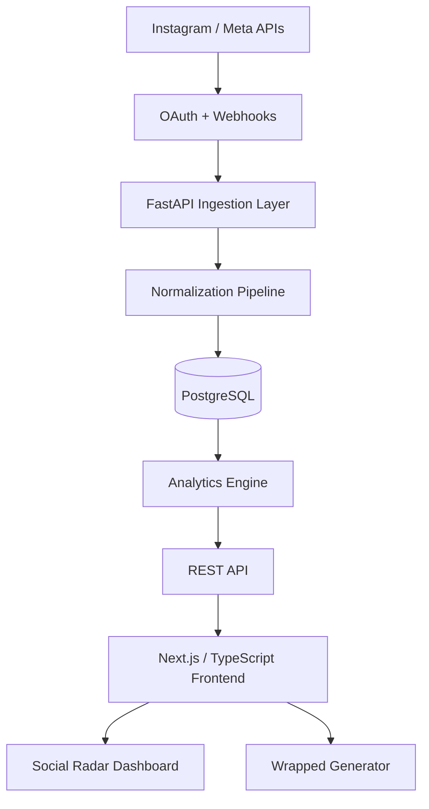

# Social Radar

**Understand your circle. See your year.**

Social Radar is a privacy-conscious social analytics platform that transforms authorized Instagram interaction data into connection insights, trend signals, and personalized **Wrapped** reports.

> **Portfolio repository:** This public repository presents the product, architecture, and engineering decisions behind Social Radar. The production application source code is maintained privately.

## Product overview

Social Radar is designed around a simple experience: connect an Instagram account through supported Meta authorization, let the platform normalize observable interaction data, and turn that activity into understandable social signals.

The application is built around two connected experiences:

- **Social Radar** — ongoing analytics for connection strength, reciprocity, interaction momentum, consistency, and meaningful changes over time.
- **Instagram Wrapped** — monthly and yearly summaries presented as polished, shareable story-style cards.

The product does **not** claim to reveal secret profile viewers or private activity that Instagram does not expose. Insights are derived from authorized, observable interaction data.

## Core features

- **Inner Circle** — ranks strong connections using observable interaction patterns.
- **Reciprocity** — compares the balance of interactions between accounts.
- **Rising Connections** — detects connections gaining interaction momentum.
- **Cooling Off** — surfaces meaningful declines in observable interaction.
- **Consistency** — measures how regularly a connection appears over time.
- **Social Signals** — converts analytics changes into short, useful notifications.
- **Monthly & Yearly Wrapped** — generates personalized social summaries.
- **Shareable Story Cards** — exports Wrapped visuals in a 1080 × 1920 format.
- **Secure account controls** — data export, Instagram disconnect, and account deletion flows.

## Architecture



The backend is structured around a provider layer so Instagram-specific API behavior can evolve without requiring the analytics and product layers to be rewritten.

## Analytics engine

Social Radar converts normalized interaction events into explainable connection metrics rather than relying on a single opaque score.

Key metrics include:

- **Interaction Score** — relative interaction strength over a selected time window.
- **Reciprocity Score** — balance between inbound and outbound observable interaction.
- **Consistency Score** — regularity of activity over time.
- **Momentum** — direction and magnitude of recent interaction change.
- **Social Score** — a high-level account summary derived from multiple normalized signals.

Scoring is period-aware so monthly and yearly reports are calculated from the appropriate underlying time range.

## Tech stack

| Layer | Technology |
|---|---|
| Frontend | Next.js, React, TypeScript |
| Backend | Python, FastAPI |
| Database | PostgreSQL, SQLAlchemy |
| Authentication | Secure cookie sessions + OAuth provider flow |
| Social integration | Meta / Instagram API, OAuth, Webhooks |
| Analytics | Python-based scoring and trend analysis |
| Deployment | Vercel + Railway |
| CI | GitHub Actions |
| Testing | Pytest + frontend type/build checks |

## Engineering highlights

- Full-stack application architecture with separated frontend, API, persistence, and provider layers.
- OAuth-first design; Social Radar never asks users for their Instagram password.
- Encrypted storage design for provider access tokens.
- Same-origin backend proxy architecture for reliable HttpOnly session cookies across hosted services.
- Normalized event model for converting platform-specific activity into analytics-ready records.
- Period-aware scoring for monthly and annual reporting.
- Rate-limit-conscious sync design and webhook ingestion.
- User-facing privacy controls for export, disconnect, and deletion.
- Automated backend test coverage and CI-ready deployment workflow.

## Privacy by design

Social Radar is intentionally designed around user-authorized data and observable interactions. The application avoids unsupported scraping, password collection, session-cookie harvesting, and claims about data that Instagram does not provide.

Additional design notes are available in [`docs/privacy-design.md`](docs/privacy-design.md).

## Project structure

This repository intentionally contains **presentation and technical documentation only**. Production source code is private.

```text
social-radar/
├── README.md
├── docs/
│   ├── architecture.md
│   ├── analytics-engine.md
│   └── privacy-design.md
└── assets/
    └── README.md
```

## Current status

**v1 foundation complete — deployment and Meta production configuration in progress.**

The application foundation includes authentication, persistent data models, analytics, Wrapped generation, export/delete controls, deployment configuration, and an Instagram provider integration layer. Production Instagram access depends on the permissions and review requirements available through the current Meta developer platform.

## Planned showcase updates

Screenshots and a live demo link will be added after the production deployment is configured. Planned showcase views include:

- Overview dashboard
- Inner Circle / connection rankings
- Social Signals
- Monthly Wrapped
- Yearly Wrapped
- Settings and privacy controls

## Developer

**Osayd Jahanzeb**  
GitHub: [@Osaydj](https://github.com/Osaydj)

---

### About this repository

Social Radar is presented here as a portfolio case study. The public materials describe the product and engineering approach while keeping the production implementation private.