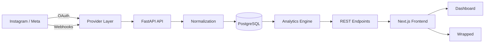
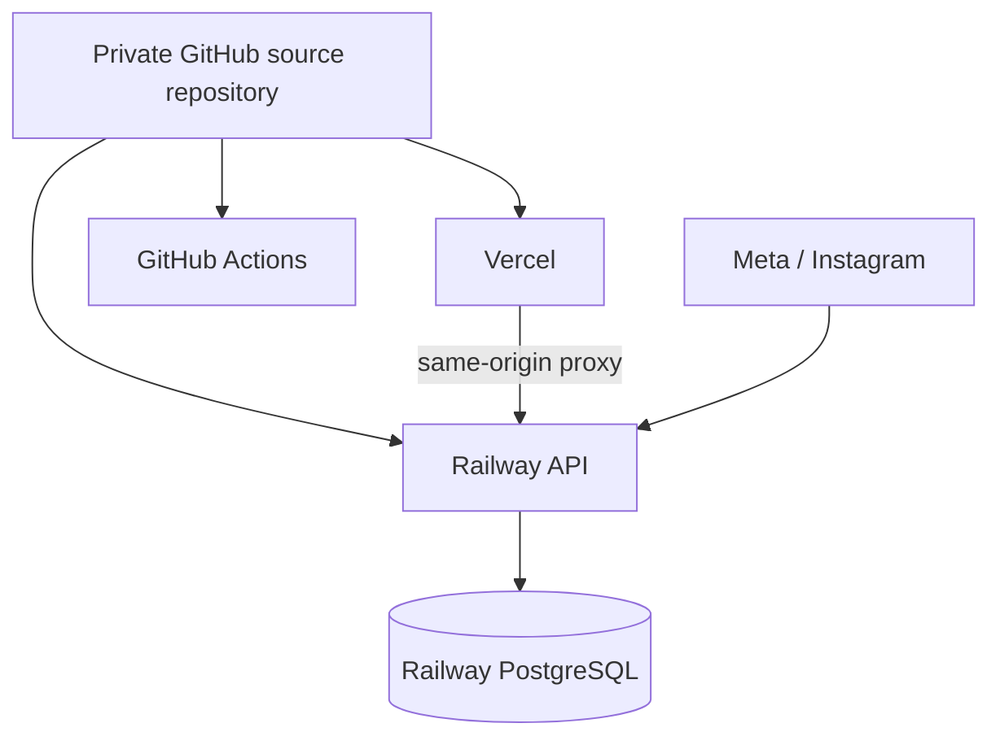

# Architecture

Social Radar is organized as a layered full-stack application so platform integration, analytics logic, persistence, and presentation can evolve independently.

## System flow

## Frontend

The client application is built with **Next.js, React, and TypeScript**. It is responsible for product navigation, account flows, analytics presentation, settings, and Wrapped rendering/export.

A same-origin `/backend` proxy is used in production so browser requests can reach the FastAPI service while preserving reliable HttpOnly session-cookie behavior across separate hosting providers.

## API layer

The backend uses **FastAPI** and exposes routes for:

- account registration and authentication;
- Instagram connection and callback handling;
- synchronization and webhook ingestion;
- dashboard analytics;
- connection rankings;
- monthly/yearly Wrapped generation;
- data export;
- provider disconnect;
- account deletion.

## Provider abstraction

Instagram integration is intentionally isolated behind a provider layer. This protects the rest of the application from changes to Meta endpoint names, scopes, token behavior, and review requirements.

The provider layer handles authorization URLs, token exchange/refresh behavior, account discovery, supported data retrieval, and event normalization.

## Persistence

**PostgreSQL** is used for production persistence through SQLAlchemy models. The data model separates users, connected social accounts, normalized interactions, sync state, and analytics-ready records.

This structure allows raw platform behavior to be converted into a stable internal schema before scoring is performed.

## Analytics

The analytics engine operates on normalized events rather than Meta-specific response shapes. This means scoring logic can be tested independently of the external provider.

Outputs include interaction strength, reciprocity, consistency, momentum, connection ranking, Social Signals, and period-specific Wrapped summaries.

## Security model

- Instagram passwords are never collected.
- OAuth access is handled through the supported provider flow.
- Provider tokens are designed to be encrypted at rest.
- Browser sessions use secure HttpOnly cookies in production.
- Secrets are supplied through deployment environment variables rather than committed to Git.
- Disconnect and deletion controls are part of the product, not administrator-only operations.

## Deployment model

The public GitHub repository you are reading is a portfolio/presentation repository. Production source code is maintained separately in a private repository.